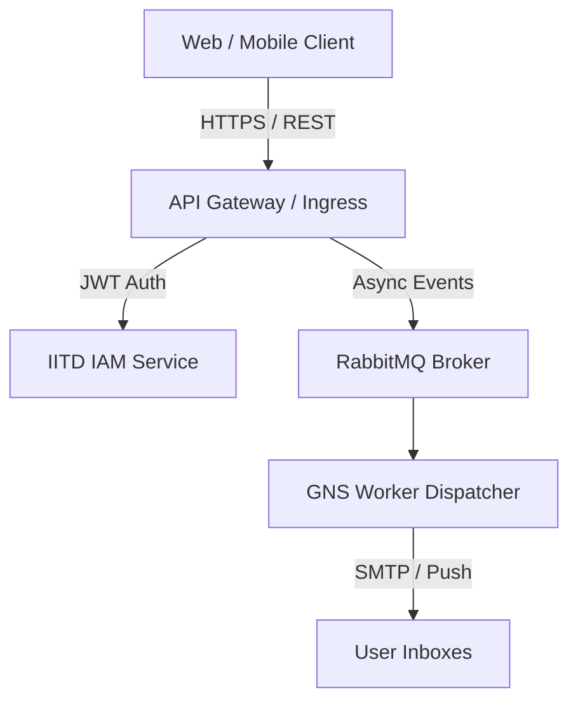

# IITDEVELOPER Repository Presentation Standard

This standard establishes the engineering and documentation baseline for all public and flagship repositories under the **IITDEVELOPER** organization (`iitdeveloper-git`).

---

## 🎯 Purpose & Philosophy

Every IITDEVELOPER public repository represents our engineering craftsmanship, architectural rigor, and platform maturity. A technical founder, engineer, auditor, or prospective client reviewing a repository should immediately understand:
1. What the project solves and why it matters.
2. The architectural topology and technical stack.
3. How to set up, configure, test, and deploy the system locally and in production.
4. How security, quality, and contributions are governed.

---

## 📑 Flagship README Anatomy

Flagship repositories must implement the following structure:

```markdown
# [Project Name]

### [One-line Value Proposition / Subtitle]

[](https://github.com/iitdeveloper-git/<repo>/actions)
[](./LICENSE)
[](./Dockerfile)
[](./SECURITY.md)

---

## 🔗 Quick Links
- [Live Demo](https://...)
- [Architecture Documentation](./docs/ARCHITECTURE.md)
- [API Specifications](./docs/API.md)
- [Local Setup Guide](#-quick-start)

---

## 💡 Overview
[2-3 paragraphs describing problem domain, technical capabilities, and target use cases]

---

## ✨ Features
- **Feature Category 1**: Specific technical capability.
- **Feature Category 2**: Specific technical capability.
- **Feature Category 3**: Specific technical capability.

---

## 🏛️ Architecture & System Design
[Include high-level Mermaid diagram demonstrating container or request flow]



---

## 🛠️ Technology Stack
- **Languages**: Python 3.12 / TypeScript 5.x
- **Frameworks**: FastAPI / Next.js 14
- **Databases**: PostgreSQL 16 / Redis 7
- **Messaging**: RabbitMQ
- **DevOps**: Docker, Docker Compose, GitHub Actions

---

## 📂 Repository Structure
```text
├── src/ / backend/      # Core service logic and APIs
├── web/ / frontend/     # Client UI / Admin portal
├── tests/               # Unit, integration, and E2E test suites
├── docker/              # Multi-stage Dockerfiles and compose specs
├── docs/                # Architecture, API docs, and runbooks
├── .github/             # CI/CD workflows and issue templates
└── README.md
```

---

## 🚀 Quick Start

### Prerequisites
- Docker & Docker Compose (v2.20+)
- Python 3.11+ / Node.js 20+

### Installation & Execution
```bash
# Clone the repository
git clone https://github.com/iitdeveloper-git/<repo>.git
cd <repo>

# Setup environment variables
cp .env.example .env

# Start with Docker Compose
docker compose up -d --build
```

---

## ⚙️ Configuration
Document all key environment variables in `.env.example` with clear inline descriptions. Never commit live production secrets.

---

## 🧪 Testing & Quality Gates
```bash
# Run unit and integration tests
pytest --cov=app tests/

# Run linter & formatter checks
ruff check .
npm run lint
```

---

## 🚀 Deployment
[Document staging, production, and container deployment pipelines]

---

## 🔒 Security
Please report vulnerabilities following our [Security Policy](./SECURITY.md).

---

## 🤝 Contributing
Contributions are welcomed! Please see [CONTRIBUTING.md](./CONTRIBUTING.md) and [CODE_OF_CONDUCT.md](./CODE_OF_CONDUCT.md).

---

## 📜 License
Distributed under the terms described in [LICENSE](./LICENSE).
```

---

## 🏷️ Repository Metadata Requirements

Every active public repository must maintain complete metadata in GitHub Settings:

1. **Description**: Concise sentence stating value proposition and primary tech stack.
2. **Website / Homepage**: Link to live product, staging environment, or documentation URL.
3. **Topics**: 5 to 10 curated GitHub topics (e.g., `iitdeveloper`, `fastapi`, `nextjs`, `docker`, `devops`, `ai`).
4. **License**: Standard open-source license (MIT, Apache-2.0) or commercial notice.
5. **Issue & PR Templates**: Inherited from `.github` or localized where specialized.
